#对象存储云服务

1. ##序言
   当今互联网网站大部分数据是给人或者机器“看”的，比如某些跟金钱没有直接关系的数据，他们的存储不需要【强一致性】和较为复杂的【事务支持】。这些数据需要较高的【可用性】，并且遵循【最终一致性】的原则，此外他们在应用时还要遵守自己特有的规则。在【云交易平台】中，可以预见这种形式数据是海量的，访问量是巨大的。本文重点是给出一种设计，基于这个设计可以实现出支持这种应用形式的分布式数据存储系统。这个系统是完全【对称分布】和【去中心化】的，具有【高可用】和【弹性扩展】能力，并可以方便的衍生出以这个存储为【数据源】的其他去【中心化】分布式服务。

2. ##基本构成
   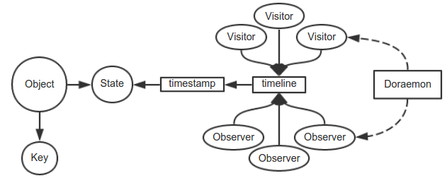
   
   这个系统被命名为Doraemon，他是一个【去中心化】的【分布式存储系统】，跟其他的【NoSQL数据库】不同的是，一般【NoSQL数据库】的Client端只是一个【数据库驱动】，是【瘦客户端】，而Doraemon的客户端是较为胖一些的客户端，并且分离读和写为两个不同的对象，【参与者Visitor】负责写，【观察者Observer】负责读，这两种对象拥有自己的【时间线timeline】，他们写读的目标是对象的内容，一个对象具有不变的【键值Key】和基于【时间戳timestamp】的【状态State】。

3. ##Object时间戳不重复原则
   
   
   对象的实际数据是State，State随着时间变化而变化（如S0，S1，S2，S3，S4），每次变化的时间点称之为timestamp（如t0，t1，t2，t3，t4），所谓的timestamp不是真实的时间点，而是一条虚拟的timeline上的逻辑时间点，State的timestamp必须遵循下面这个原则：对于同一个Object绝对不会有两个不同的State具有相同的timestamp。
    
4. ##Visitor时间线不重合原则
   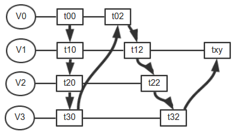
   
   Visitor对象负责写，不同的Visitor也可以写相同的Object，每个Visitor拥有一条虚拟的【时间线timeline】，不同的Visitor之间这些时间线平行而任意两点不会重合，同一个Visitor在真实时间上先后修改的对象在他的timeline上的timestamp一定也是从小到大的顺序。在任何真实时刻，不同Visitor修改的对象在各自timeline上的timestamp也绝对不会冲突。如图，V0~V3在各自timeline上对某个对象进行修改，尽管t00~t30在真实时间上是同时发生的，但是在Doraemon的timeline上他们是先后发生的。
    
5. ##Observer时间线不回退原则
   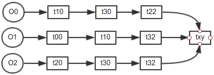
   
   Observer对象用来观察对象，对于每个Object，每个Observer都有一条自己的timeline，这个timeline只会前进而不会后退，如果观察到某个Object的状态的timestamp为t，在之后再观察这个Object，timestamp绝对不会回退到t之前。如果没有Visitor对该Object进行修改，观察某个Object的所有Observer会在某个时间窗口之后都观察到一致的timestamp。如图，O0~O2在观察之前V0~V3写的某个Object，他们在同一个真实时间观察到的时间戳可能是不一样的，而且O0观察到t30之后他绝对不会再观察到t10的状态，最终他们都将观察到txy。

6. ##对称分布结构
   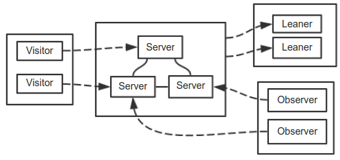
   
   Doraemon根据功能可以分为四个部分【服务者Server】【学习者Leaner】【观察者Observer】【访问者Visitor】。这些部分功能不同，但都是【去中心化】的【对等结构】。

   1. ###服务者Server
      是Doraemon的存储主体，负责存储所有的数据，并实现高可用。Server完成分片和冗余，并处理Visitor和Observer的读写请求。他与Visitor和Observer构成最基本的高可用对象存储。
  
   2. ###学习者Leaner
      Leaner是一个简化的Server，他的作用是对接第三方系统，比如数据库和搜索引擎，将Server中保存数据的变化推送给第三方。
  
   3. ###访问者Visitor
      Visitor在客户机器上运行，用来向Server写入数据。
  
   4. ###观察者Observer
      Observer在客户机器上运行，用来向Server请求最新的数据。
  
  【Visitor】【Observer】是较胖的客户端，他们会持久化一些信息，确保高可用和他们所遵守的原则。
    
7. ##Visitor时间戳的产生
   

   一个时间戳是由【服务器时间属性】【客户端时间属性】【操作时间属性】三者合成的，确保任何时候产生的时间戳都不会重合。

   1. ###Server时间属性
      需要向Server申请才能产生Visitor，因此Visitor就带了他所申请的Server的属性。
      t：服务器的实际时间。
      s：服务器时间误差位数。
      m：服务器的全局id。
      g：该服务器一次时间窗口之内第几次产生Visitor。
  
   2. ###Client时间属性
      Visitor在客户端上产生，因此他也带有Client时间属性。
      origin_time：Visitor产生的时间。
      i：origin_time到此刻的时间间隔。
  
   3. ###操作时间属性。
      c：本次是Visitor生成以来第几次操作。
      r：一个随机数。
    
   4. ####当前时间戳计算方式是：
      (64,t&(-1<<s))+(s,i):(32,m):(32,g):c:r

8. ##Server的同步
   1. ###Server同步原则
      
      
      Server之间有两个数据同步过程，分别是【Global Sync】和【Data Sync】，【Global Sync】用来将Server的【全局信息Global】进行同步，Global信息包括【健康信息Healthy】【种子和连接信息Seeds】【分片信息Replicantion】【数据概要Data Profile】,这些同步信息是服务的基础。在【Global Sync】正常的基础上，会进行【Data Sync】，用来在Server之间复制【数据 Data】，实现【数据容灾】【高可用】以及【弹性扩展】。
        
   2. ###Server之间【Global Sync】
      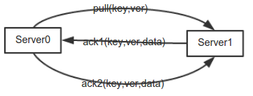
      
      Server之间的Global同步采用Gossip协议的pull/push方法，例如，Server0会根据之前了解到的全局信息，周期性的发送pull(key,ver)到某个Server（例如Server1），如果Server1了解到的信息比当前Server0新，会发送ack1(key,ver,data)回来，如果Server1的信息比当前的旧，data则为空。当Server0收到ack1之后，如果data为空，Server0则发送ack2(key,ver,data)到Server1。如此几个周期之后所有的Server都应该了解最新的情况。
        
   3. ###Server之间【Data Sync】
      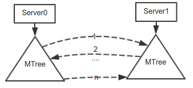
      
      每个Server会维护一颗【Merkle Tree】，通过比较【Merkle Tree】可以知晓两个Server之间的差异。如图，对Server0来说，Server1的【Merkle Tree】的前几层在【Global Sync】的时候就会同步过来，然后和【Global Sync】类似，但协议略做变化，Server0会采用【深度优先】的方式跟Server1对比整颗树，并同步叶子节点的数据过来，之后再重新计算【Merkle Tree】。
        
9. ##对象构成
   1. ###Server构成
      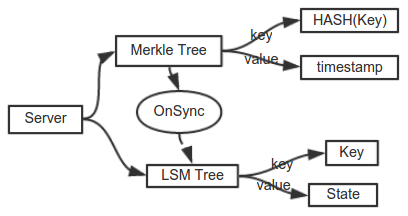
      
      Server最主要的两个部分是一颗【Merkle Tree】和一颗【LSM Tree】，【Merkle Tree】用来与其他的Server进行【Data Sync】，在更新【Merkle Tree】之前Server会先将同步到的数据插入【LSM Tree】中，【LSM Tree】的key是Object的Key，value是Object的State。而【Merkle Tree】的叶节点的key是Object Key的HASH值的【Sub Range】，他的值是一批timestamp的XOR，而父节点的值是子节点值的XOR。
        
   2. ###Observer构成
      
      
      Observer最主要的两个部分是一颗【LSM Tree】和一个【Server分片表】，【Server分片表】从Server同步所得，根据Key获取数据的时候，Observer先在【Server分片表】中查找到合适的Server，再从该Server获取Object的State，当State中的timestamp小于LSM Tree中所存的State的timestamp时，则返回【LSM Tree】中的State，否则，采用获取到的State更新【LSM Tree】中的State。此种情况可以优化为Observer访问Server的时候带上【LSM Tree】中的timestamp，又Server判断是否需要返回State。
        
   3. ###Observer的退化
      
      
      真实情况下，将访问量分拆成单个用户来看，单个用户是简单的访问几个特定的Object，而不是大量的不同Object。对于这种情况，Observer就显得过于庞大，并且需要专门的服务器来支持。
    
      Watch对象是一个退化的Observer，每一个Watch只能访问一个特定的Object，他保存最新的State，并且在执行Fetch的时候对比从Server端拿到的数据是否比他保存的更新。
    
      Watch的好处在于足够简单，甚至可以在前端或者js脚本实现这个对象，让这些信息被缓存到用户浏览器中。
        
10. ##分片
   1. ###一致性Hash和虚拟节点。
      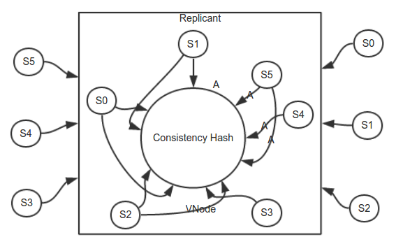
      
      每个Server都会维护一个名为【分片Replicant】的结构，这个结构是这样的：每一个Server会根据自己的资源多少定义若干个【虚拟节点Virtual Node】，我们假定每个【Virtual Node】的计算和存储能力都是一样的，那么所有的【Virtual Node】会自动的均匀的分布到Hash圆上。而Hash圆上任何一段Range会被映射到他之后的三个【Virtual Node】上。如图，A处的Range会被映射到S5和S4.

      初始，并不是所有Server的Replicant结构都一致，在集群数量没有变化的情况下，他们最终会通过【Global Sync】在一定的【时间窗口】内达成一致，这是【Gossip协议】做的。
        
   2. ###内部结构和交互过程
      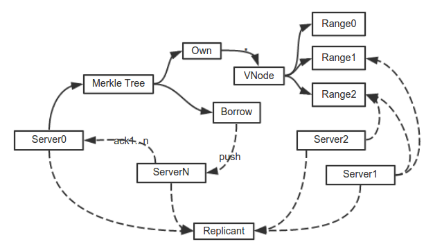
      
      为了配合【一致性Hash】和【虚拟节点】以及实现【弹性扩展】，Server的【Merkle Tree】下的子分支被分为两个类型【Own】和【Borrow】。
    
     【Borrow】代表在Replication的规划中不属于该Server的数据。这个部分的数据将会被同步到他属于的Server去（如Server0）。一旦确认数据被成功推送过去，Borrow下的数据将被删除。
    
     【Own】代表在Replication的规划中属于该Server的数据。由于在Hash环上一个Range会被映射到三个VNode中，因此每个VNode会有三个【Merkle Tree】分支（Rep0，Rep1，Rep2）。这几个Range将根据Replicantion的情况跟同样持有这些Range的Server进行同步（如 Server1和Server2）。
        
11. ##用Leaner实现功能扩展
   1. ###Leaner的作用
      
      
      如果只是上面所提到的设计，那么整个系统也不过就是一个【K-V】形式的【对象存储】而已。而Leaner可以扩展这个系统使他成为其他功能的数据源，例如可以实现一个LuceneLeaner的实例轻松对Server中存储的数据建立【分布式索引】。如图，LuceneLeaner会继承Server的分片逻辑，并从Server同步数据，你需要实现的就是当LuceneLeaner同步到数据的时候操作Lucene实例建立索引，并在查询的时候做归并就可以了。
        
   2. ###Leaner的结构和交互
      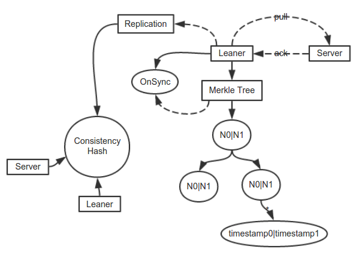
      
      由于Leaner不会保存原始的State数据，因此Leaner和Server之间只能采用【Gossip协议】的pull方法，并且Leaner的【Merkle Tree】跟Server不一样。
      1. Leaner会与其他Leaner进行【Global Sync】并在分割Hash圆上达成一致。
      2. Leaner会从Server那里同步Server的【Global数据】。
      3. Leaner中主要结构是一颗变异的【Merkle Tree】，这个树的父节点和叶节点都存在两个变量N0和N1，这两个值初始都为空。
      4. Leaner采用Gossip的pull协议与Server进行【Merkle Tree】的同步。
      5. 如果当前同步的叶节点数据timestamp小于等于N0的时候，需要放置于N1里面，并且刷新所有父节点N1的值，同步数据无效。
      6. 如果当前同步的叶节点数据大于N0的时候，需要将N1和N0都变为这个值，并且刷新所有父节点N1和N0的值，同步数据有效。
      7. Leaner在同步到有效数据时会调用OnSync回调方法，这时Leaner的继承者会收到事件并进行相应的处理。
        
12. ##代替品
   【开源领域】目前有多种【对象存储系统】可以使用，比如Swift和Cassandra等，甚至MongoDB也可以用作【对象存储】，从上面设计的功能看，Swift和Cassandra要实现本文的功能需要进行深度的第二次开发。而MongoDB经过一些包装就可以实现所有的功能，但是因为运行原理和内部结构完全不一样，性能会差很多，特别是Visitor和Leaner两个对象。
    
13. ##简化版
   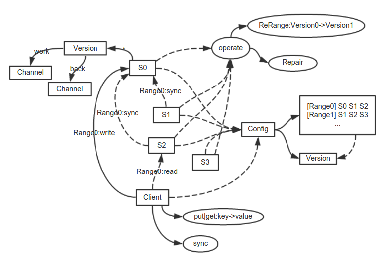
   
   如果重点在于【容灾】和【快速存取】，并且允许【停机维护】且【规模不大】，那么可以实现一个简化版的系统。
   1. 每个Server都要人工配置一个Config，对Config修改一次都会产生一个新的Version，Config里面内容是所有Server的分片方式，第一个Server是master，其他是slave。
   2. Server之间或者和Client之间的交互必须是同一个Version的Config才能进行。
   3. 每个Server都会为当前的Version产生两个Channel，一个是工作的，一个是备份的。当Version变化之后，旧的Channel在一段窗口时间内不会删除。
   4. Client的put|get操作会根据Config访问相应的Server。
   5. Client的sync操作会根据Config访问所有的master的work Channel。
   6. 同一个Range下，slave Server会从master Server那里同步对应数据到back Channel。
   7. Server会根据当前Config的情况自发的进行ReRange和Repair操作。ReRange的操作是读取旧Version下的Channel并重新生成新的Channel，Repare的操作则是访问其他Server上的back Channel来恢复数据。
