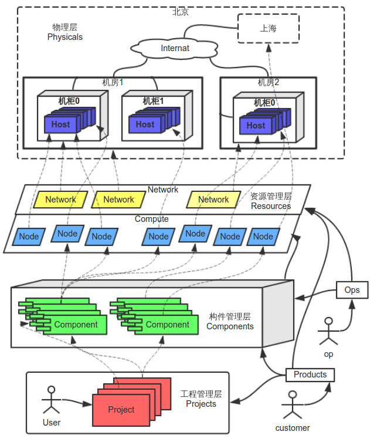
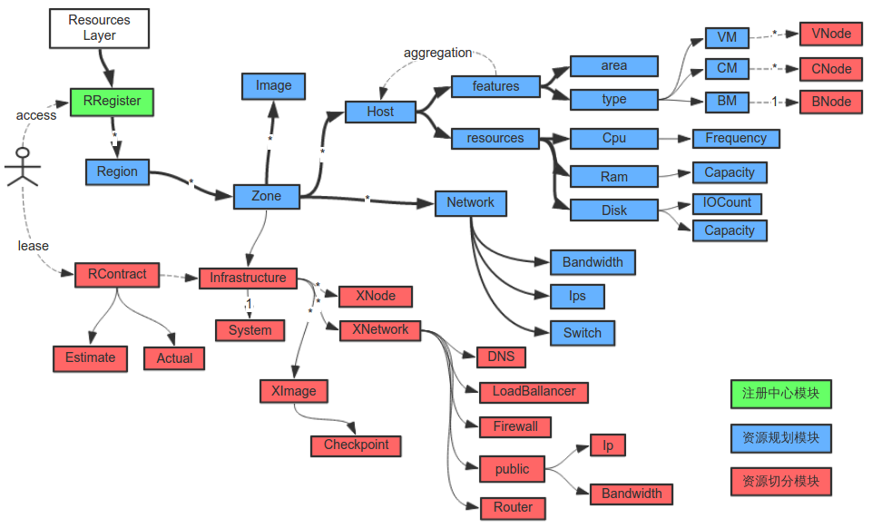
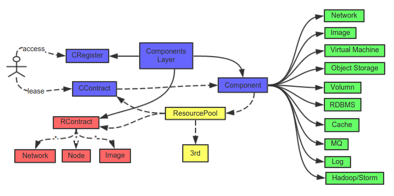
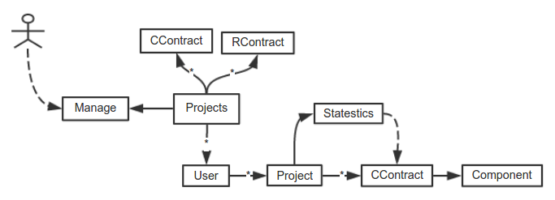
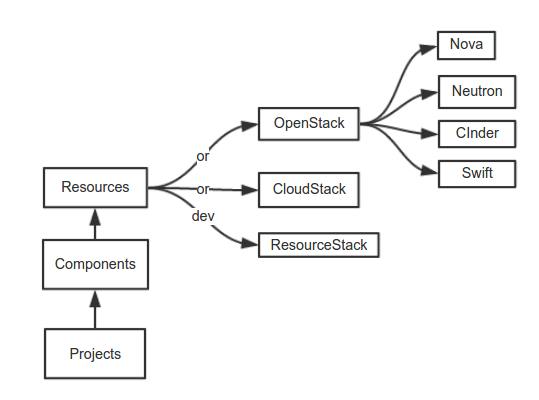

主机云服务
========

1. ##前言
   我们的【云交易平台】最终必定是一个【混合云】，这个【混合云】提供的云服务是【XaaS】而不只是【IaaS】，那么这个平台应该是可以【逐级】被【扩展】和【丰富】的，为了合理利用资源，我们没有按照常见【开源云计算平台】的形式来架构。云的范围不仅仅指【云主机】和【云存储】还指各个【业务层】的云化。
   
   本文介绍了【云交易平台】的基石之一【主机云服务】的整体架构，以及借助这个机会说明【云交易平台】的资源分配结构，例如，如何向【云交易平台】提供【基础服务】，并且如何将资源作为产品向用户出售的方法。在最后会简要提出利用【开源系统】进行【二次开发】快速搭建这个平台的方法。
   
   本文中重点在说明【主机云服务】的整体架构，以及需要使用哪些特有的技术，对于一些技术细节不做深入，这些技术细节会记录在其他文档中，比如，如何使一个服务表现出【HA特性】，请参考另外一篇技术文档【HA云服务】
   
2. ##三层资源分配架构。
   
   
   
   【主机云服务】包涵两个意思，第一，这个服务本身就是我们【云交易平台】计算资源的提供者，第二，这个服务可以作为【云产品】被出租。因此，整个服务被分为三层，一个平台化的【私有主机云】，一个建立在【私有主机云】上的【公有主机云】，和一个建立在前两者之上的【主机租用业务】。因为【主机云服务】只是整个【云交易平台】的一部分，并且这三层跟通常的【云计算平台】的分层有些不一样，所以这三层被称为【资源管理层Resources】【构件管理层Components】和【工程管理层Projects】。同时这三层建立在真正的【物理层Physicals】之上。在后面可以看到，在【Components】和【Projects】中，【主机云】的业务只是一个很小的部分。
   
   1. ###【Physicals】
      这一层不是【软件架构】，而是实际工程上的【物理结构】，后面的三个【软件范围】的层是构建在他之上的。我们设想一下【数据中心】中各主机的部署情况。在【大型系统】部署中，我们通常会根据【网络互联互通】的情况将主机分散部署在某几个【地区】，比如北京和上海，而同一个地区】又可能分布在数个不同的【机房】中。在【机房】中，【物理主机】被放置在【机柜】上，并由【接入层交换机】逐级链接向机房的【核心层交换机】。这些都是由真正的【运维工作人员】布置的。
      
   2. ###【Resources】
      【Resources】是一个【量级较轻】的【私有云】软件系统，这是在【物理层】上部署的第一个【软件系统】，这个云负责对所有【计算资源】进行【精确】和【定点】的管理，并对外提供【申请渠道】，这些资源是最基础的计算资源，比如【虚拟机】【虚拟网络设备】甚至是【物理机】和【物理网络设备】。
      
      【Resources】会管理对基础【计算资源】的申请，并对【使用量】进行精确的计数，这一层提供的资源都是精确的，不提供【自动调度】功能。比如，某个【合同】确切的租用了某台【主机】上的某台【虚拟机】，或者是这些【主机】上【虚拟机】的真实运行情况是怎样，又或者将服务从这个【主机】的【虚拟机】移动到另一个【主机】要怎样进行。也就是说将真正的【机房管理】尽可能的搬到【线上】，为后面几层的服务提供一个可被精确切分的【虚拟物理层】。
      
      【Resources】提供的是可以精确定位的基础【计算资源】，不提供任何资源本身的【HA属性】，比如如果一台【虚拟机】宕机了，除非你手工重启，在这一刻他确实是不可用的。但是【Resources】应该要保证这个【虚拟机】的当前状态必须正确的被反应出来，并且如果你通过【Resources】启动【虚拟机】，如果对应的【主机】没有损坏或者异常的话，他上面的这台【虚拟主机】应该确切的被【启动】起来。
      
   3. ###【Components】
      【Components】在【Resources】的基础上进行【包装】和【智能调度】，提供【服务质量】和【计算资源】可被度量的【构件（Component）】以及构件的【申请方式】，Component大体上分为两种，一种是对【Resources】中的【计算资源】进行包装并提供【HA属性】的构件，这种构件对于用户来说仍然是【基础资源】，例如【云主机】【虚拟网络设备】等。另一种就是直接在【Resources】基础上构建更高级的服务的形式，例如【云盘】【对象存储】【Cache服务】【RDBMS服务】等。不同于【Resources】对资源的使用会精确定位，Component需要对外提供【HA属性】，而且Component中必须对资源进行【冗余】并实现【弹性】管理。
      
   4. ###【Projects】
      【Projects】的核心是【用户（User）】和【工程（Project）】，Project聚合多个Component以实现一个目的，User下可以管理多个Project，Project下所有Component的【计算资源】实际使用量将被Project统计和收集。

    上面三层是【计算资源管理】的【基础软件框架】，他将资源逐级分配，并可以灵活的使用和扩展。例如我们可以将【对外产品（Products）】和【内部管理系统（Ops）】作为两个【子系统】分开开发，由于【Ops】并不需要处理【Customer】相关的业务，并且【HA指标】比较低，因此他直接访问【Resources】和【Components】提供的接口来实现监控功能，而且他的服务可以直接构建在【Resources】层提供的【计算资源】上。而Products为了实现较高的【HA属性】，则需要使用【Components】提供的各种设施来构建。
    
3. ##资源管理层（Resources）
   
   
   
   【Resources】的目的是将【运维】的工作尽可能从【线下】搬到【线上】，为后面【Components】进行【智能调度】打好基础，【Resources】层分为三块，分别是【注册中心模块】【物理规划模块】【资源切分模块】，下面对这三块进行说明。
   
   1. ###注册中心模块（RRegister）
      这一块横跨了所有机房，是整个【资源管理层】的【物理设备】的注册中心，其中会注册【物理规划模块】中【所有资源】的位置和其他的状态信息，这些信息将供用户进行【资源定位】和【状态查询】，这一块应该是一个【全局范围】的【弱一致性对象存储】。当一个新【机房】将要建立的时候，第一件事就是需要搭建这个模块，并同步全局的【Resources】层的信息。
      
   2. ###资源规划模块
      【资源规划模块】是【Resources】层的主干，他是线下【物理主机】和【网络链接】在【Resources】层的映射，他精确反应了物理上各主机真实的部署情况以及状态。
      1. ####Region
         代表一个大的【地域】，这个【地域】下应该包括多个【IDC机房】，而这些机房应该在地理位置上相对集中，或者是访问这个Region的【用户】在地理位置上相对集中。
      2. ####Zone
         代表一个工程上相对独立的【区域】，比如同一个【IDC机房】的【物理主机】，或者在同一个【机房】中同一批，具有一定联系的，同时大量部署的【物理主机】。
      3. ####Host
         代表一台【物理主机】，每一台【物理主机】从上线开始就需要配置一些【属性】，这些【属性】包括两类，【featrues】【resources】
         
            1. 【resources】代表这台机器可供使用的【计算资源】，包括【Cpu 主频】【Ram 容量】以及【Disk 容量和剩余IO数】
            2. 【featrues】代表这台机器上的【计算资源】将以什么方式被切分，被用作【资源切分模块】切分资源以及【Components】调度资源的依据,这个属性下有两个【子属性】。
               1. 【部署位置area】可以用来记录【物理主机】所部署在某个【机柜】上某个位置的【虚拟编号】，area越接近说明他们同时故障的几率越大。
               2. 【节点类型type】说明这台机器中的资源将以什么形式被切分，我们考虑了三种【资源切分类型】：
                  1. 【VM】 采用完全隔离的【虚拟机】（如KVM等）切分资源，一个Host的资源会被动态切分成若干个【VNode】，每个【VNode】是一个【虚拟机实例】，这种隔离方式的好处是每个【实例】拥有独立的【操作系统】，不同实例内部空间是完全隔离的，完全没有安全隐患，缺点是运行多个【操作系统】会浪费一部分【主机资源】。
                  2. 【CM】 采用轻量级的【应用容器】（如Docker等）切分资源，一个Host的资源会被动态切分成若干个【CNode】，每个【CNode】是一个【Container实例】，这种隔离方式的好处是所有的Container共用同一个【操作系统】，分割资源的代价小，缺点是Container的隔离技术是对宿主【操作系统】的分割，Container不能再安装其他【操作系统】，而且所有实例的内部应用都共用同一个【Linux内核】，有【安全隐患】。
                  3. 【BM】 意味这个Host上的【计算资源】作为一个整体参与计算，不作切分，这种类型的Host只有一个节点，那就是【BNode】，实际上，这个节点是裸机运行的。当然，运行在【BNode】上的服务需要能尽可能的榨干Host的【计算资源】。
                  当然，Node的创建和管理是【资源切分模块】的工作，本模块中只是提供信息，说明这些Host的属性。
      4. ####Network
         代表各个主机之间的【物理通信链路】，有三个资源可以被切分【外部带宽（Bandwidth）】【广域网ip（ips）】【交换机（Switch）】，前两个资源比较好理解，第三个资源【Switch】代表网络中Host之间进行【数据交换与限制】的能力，可以被理解为【L2/3】的【物理交换机】或者【虚拟交换机】以及各个主机的【Iptables】，这些资源也应该是可以被切分和管理的。
         
      5. ####Image
         这个部分的作用是对【主机镜像】的管理和获取，我们安装【物理主机】的【操作系统OS】的时候，如果物理机支持【PXE】等协议，那么他的安装也可以是【自动】的，自动安装的【镜像Image】就是来自于【Image模块】。同时当主机磁盘变化的时候我们可以建立镜像的【checkpoint】和【branch】来跟踪这些变化，这些【checkpoint】可以作为【Image资源】被再次使用。即使我们的主机不支持【PXE】，对每个机器【镜像】的【备份】也是必要的。【Image模块】也会用来管理【Node】的镜像。
         
   3. ###资源切分模块
      这一块中，系统采用特定方式对【物理主机】和【网络链接】的资源进行切分，以及采用【租赁合同】的方式将【可量化】的资源划分出来供给【第三方】使用。由于资源切分的手段多样，需要切分的资源也多样，因此我们暂不考虑实际的切分手段，而看一下我们切分的结果是什么。
      
      需要说明的是，这一个模块中，被切分出来的【计算资源】所处的位置是精确的，比如某台【物理主机】的上的某个【虚拟节点】。
      
      1. ####Infrastructure
         切分之后的组件我们称之为【基础设施】，每个【基础设施】都会占据一定的【计算资源】，具体的可以分为下面几个类型。
         1. #####System
            【切分资源】的行为也是程序实现的，本身就需要消耗【计算资源】，比如要运行【虚拟机程序】或者是【虚拟交换机程序】，这个部分的消耗会随着被切分资源数量的增加而增加，因此，在对【实际系统】估算【切分资源】的时候需要将这部分考虑进去。这部分资源只是需要【估计出来】，并不【对外出租】。
         2. #####XImage
            对物理结构中【Image模块】的切分，他会限制所保存【checkpoint】的【个数】和【大小】。
            
         3. #####XNode
            对【物理主机】上【计算资源】的切分，如上所说，对应于Host的type：VM，CM和BM，有VNode，CNode和BNode三种切分形式。
            
         4. #####XNetwork
            对【资源规划模块】中【Network资源】的切分，每个【XNetwork】可以看成一个子网，里面有各种子网可以用到的虚拟设备，比如DNS，Router，LoadBallancer和Firewall，同时，有一种特殊的XNetwork是【Public Network】，这个Network具有【分配广域网ip】和【限制带宽】的能力。
            
            虽然我们不会对Infrastructure里面的内容加上【HA属性】，但是我们对每个【组件】都会有【跨Zone】和【跨Region】的移动和复制的方法，就像【实际机房】中人工搬运主机一样。
            
            Infrastructure中的【组件】还需要提供一系列的方法，CopyFrom，PowerOn/Off，Hibernation/Active等，用来【管理】组件的【状态】，处于不同状态的组件对资源的消耗量是不一样的。
            
      2. ####RContract
         【Resources】层弱化了用户的概念，对资源的租用是以【RContract】为主体来管理的，每一个【RContract】都会记录需要【租用】的Infrastructure中【计算资源】的内容，并对这些资源进行【预设】和【实际使用量】统计。
         
4. ##构件管理层（Components）
   
   
   
   【Resources】层提供的是【基础设施】，他将【运维】的工作搬到线上，并不会在实际应用时的【高可用性HA】上做过多的工作。而【Components】是建立在【Resources】层提供的【基础设施】之上，根据不同的情况，提供不同的【HA】构件来满足用户需求 。可以认为【Components】层提供的【构件】是一种较为高级别的具有【HA属性】的【基础设施】。
   
   1. ###概要
      首先【Components】层本身就是建立在【Resources】提供的【基础设施】之上的，【Components】层的主体是【Component】,【Component】将各个级别的【资源】封装起来，并提供对应的【HA属性】。
      
         1. 比如在【Resources】中我们可以申请的【计算资源】只有【XNetwork】【XNode】【XImage】几个，对这些资源的访问都被限制在一个Zone的内部，不能跨Zone去访问，当我们【指定】并【分配】一个Node的时候，我们可以精确的预测这个Node被放在了哪个【物理主机】上。
         2. 【Components】中，以Component形式提供的资源的种类远超出了【Resources】中的形式，这些【资源】被提供后，我们不能准确的预测他在运行时具体所处的位置，比如我们可以提供一个【Virtual Machine】的【Component】作为Node的在【Components】层的封装，尽管我们申请的时候【预设】了他【计算资源】的大小，但是我们依然不能准确的预测，处在【运行状态】时他究竟在哪个【物理主机】上，这个工作是在启动Node的时候由Components根据【实际情况】进行调度的。
         
      和RContract类似，用户可以通过CContract租用【Components】中的资源。不同的是，CContract只会对描述需求，不会精确的指定资源在【Resources】内【资源规划模块】中的位置，CContract会有一个【HA属性】可以选择，对应于【Resource】层的具体位置则是由【Components】在运行时来做的。
      
      将【Resources】层的RContract进行包装，可以开发出各种各样的Component。
         1. 比如动态向【Resources】层申请Node，确保同一个时间最多只有一个实例在运行，这种Component对用户来说这就是云主机。
         2. 同样可以将Network以及Image包装起来做成具有【HA属性】的Component。
         3. 【云交易平台】的其他组件如【RDBMS云服务】【Object 存储云服务】【Cache 云服务】等都可以以Component的形式提供服务。
         
      【Components】是一种开放的【框架】，【Components】框架的具体实现时需要向【Resources】申请RContract，但Component具体实现时所需要申请的资源并不一定是RContract，还可以是其他的【资源池ResourcePool】，例如另外一个Component的CContract，这个【ResourcePool】甚至可以是【第三方平台】提供的资源。所有的Component都必须遵循一个原则，那就是只能通过CContract申请Component的【资源】。
      
      由于Components横跨全局【数据中心】，因此Components也必须有一个全局的【注册入口CRegister】，CRegister是Components【跨Zone调度】的信息中心。与【Resources】层的RRegister一样，这个Register也需要【全局范围】的【弱一致性对象存储】支持。
         
   2. ###Component的HA属性。
      
      
      
      前一节说过，CContract中只是描述如何使用资源，资源具体调配到什么位置是Components做的，那么我们来看看Components如何处理资源的调配问题。
      
      对于每一个Component对象，都有两个属性，一个是【distribution】一个是【access】。
      
         1. ####distribution属性
            这个属性用来说明Component资源分配特点，有两个值，【Flat】和【Cell】。
            
            【Flat】说明这个Component的创建不需要临时申请【ResourcePool】资源，对【ResourcePool】资源的申请是在该Component类型创建的时候批量做的，对于这种类型的Component，会直接由【Components】进行资源分配，不再通知【ResourcePool】层。例如【对象存储云服务】就是这样的Component，这个服务会申请一大批资源，直接在内部对这些资源进行分配和管理，新产生【对象存储】不再与【ResourcePool】通信。Flat下有个参数是【高可用值w/r】，这个值是属于该Component类型的，说明这种类型的Component实例有几个写入口和几分冗余副本。
            
            【Cell】说明这个Component的创建会引起【ResourcePool】资源的临时申请，【Components】层只是对资源进行调度，真正分配是由【ResourcePool】层做的。例如【RDBMS云服务】，这个服务如果不需要支持【大量数据】，就有可能是【Cell】属性的Component。Cell下也有个参数是【高可用值w/r】，同样说明有几个写入口和几分冗余副本，不同的是这个值是属于Component实例的。
            
         2. ####access属性
            这个属性用来说明Component可访问性，有三个值，【Full】【Region】【Zone】
            
               【Full】说明所有的Node都可以访问这个Component实例，也意味着这个类型的Component的容灾域是所有的数据中心。
               
               【Region】说明同一个Region下的Node可以访问这个Component实例，也意味着这个类型的Component的容灾域是Region，这样的Component需要提供一个方法，用来跨Region域拷贝。
               
               【Zone】说明同一个Zone下的Node可以访问这个Component实例，也意味着这个类型的Component的容灾域是Zone，这样的Component需要提供一个方法，用来跨Zone域拷贝。
               
        当用户向【Components】申请资源的时候，会获取一个【租赁合同CContract】，这个合同会维护一个【调度器Scheduler】，调度器会根据CContract中的描述和具体情况向Resources或者是第三方资源池申请资源，并根据实际情况对这些资源进行管理。CContract会记录Components预估资源和实际使用资源的情况。
        
5. ##工程管理层（Projects）
   
   
   
   上面两层都是以【计算资源】为中心的，【Projects】中则是以【用户User】为中心进行【资源分配】的。
   
   1. 【Projects】本身建立在【Components】和【Resources】所提供资源的基础上。
   2. 【Projects】维护一个【用户User】列表，代表【资源使用者】。
   3.  每个【User】下可以管理若干个【Project】，一个Project代表由于同一个目的而申请的Component集合，因此Project管理若干个CContract。
   4. 【User】可以根据需要去设置每一个CContract所租用的资源，并且可以分Project统计资源使用情况。
   5. 【Projects】是一个横跨全局数据中心的系统，具有全局有效的访问接口，因此可以采用【Components】提供的【Flat】和【Full】属性的构件。
   6.  本文中所叙述的不是【产品相关】的【业务系统】，而是【业务系统】之下的【基础子系统】，比如，在本系统中认为所有接受到的消息都是安全的，所有跟用户【安全访问】相关的处理是在他之上的【业务系统】要做的。
   
6. ##采用开源系统
   
   
   
   一开始就自主开发一个【主机云服务】子系统是庞大的工程，因此可以考虑找一个合适的【开源云计算管理平台】并进行【第二次开发】来实现，目前业界有几个比较流行的【开源云计算管理平台】，如OpenStack，CloudStack，OpenNubula，Eucalyptus等，通过研究，这些系统的【架构】和【模型】与我们的【主机云服务】都有较大的差异。为了可以持续的改进系统以及能在各个层面进行扩展，【主机云服务】被设计成以三个不同层次的【资源分配架构】，而上面的几个【开源平台】都只有一层【资源分配架构】。
   
   综合考虑上面几个【开源系统】的【授权方式】以及系统和文档的完善程度，最终定位到OpenStack和CloudStack两个系统上，OpenStack是Python开发的，是松散的服务化的模块结构，功能非常强大，适合【第二次开发】，支持的【硬件厂商】也很多，但是部署比较复杂，提供的功能多而很多都不完善，当然如果是要做【第二次开发】，就必须了解这个系统的【代码细节】，那么这些都不是问题了。CloudStack是Java开发的，是【框架】加【插件】的【体系结构】，在【第二次开发】上有一定的难度，部署相对简单，由于CloudStack企业版是【商业软件】，软件的【质量】和功能的【完整性】上占据一定的优势，而且他的【资源管理模型】与我们【三层架构】中的【Resources】层最接近。
   
   【主机云服务】是整个【云交易平台】的【基础设施】，非常重要，架构一旦成型就很难替换，采用【开源系统】的话，未免会要为我们用不到的功能消耗不必要的资源。因此我们可以这样做:
   
   1. 首先在CloudStack的基础上实现【Resources】层。
   2. 独立开发【Components】层和【Projects】层。
   3. 同时自主研发一个叫【ResourceStack】的模块【逐步替换】掉CloudStack。
   4. 【ResourceStack】一定是以最适合【我们自己平台】的架构实现的。