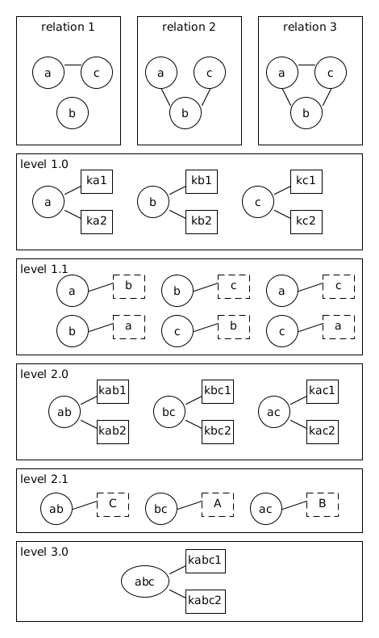
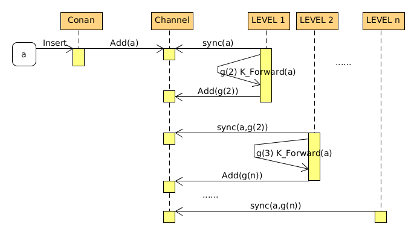

1. ##前言

2. ##相关模型和相关引擎
   万事万物之间都有关联，本节将建立一个描述各事物之间相互关系的模型，并描述一个系统可以将相关性进行管理和查询的系统。
   
   1. ###相关模型
      
      * 如图，有三个集合 A B C，可以通过一个方法判断两两之间的某个元素是否相关，那么选取其中的元素 a b c，如果判断出 ab ac bc 都相关，那么我们可以认为 a b c 是相关的。如果只有 AB 和 BC 存在相关性，那么可以通过判断 ab 和 bc 是否相关来确定 abc 是否相关。
      * 可以将上面的例子推广：
         1. 包含有 n 个集合 {F(1),F(2),...,F(n)} 的集合为 F , F() 命名为数据集合, F 命名为源集合, F 中的每个 F() 可选取的任意一个对象 {f(1),f(2),...,f(n)} , 组成的集合 f , f() 命名为元素, f 命名为元素集合。
         2. f 任选 x 个对象的组合 {y(x,1),y(x,2),...,y(x,C(x,n))} 组成集合 y(x) , y(x,) 命名为 x元子, y(x) 命名为 x元集合. 可以预见 y(1)==f .
         3. 在 y(2) 中选择 m 个 y(2,) { d(1),d(2),...,d(m) } 组成集合 d , 使得f是联通的, d() 命名为可判2元子, d 命名为可判2元子集合.
         4. 设存在 m 个函数 {L(1,),L(2,),...,L(m,)} 的集合 L ，对每个  L(i,d(i)) 可得一个 [0,1] 的值，这个值说明 d(i) 包含的两个元素之间在 L 上的相关性, L(,)命名为相关函数, L 命名为相关函数集合。
         5. 如果有 w 个可判2元子{ p(1),p(2),...,p(w) } 在 L 上的相关性大于较小实数v 的集合 p , p() 命名为已判二元子, p 命名为已判二元子集合, v 命名为最小感知量. 
         5. 在集合 a 中选取 x 个值可以组成集合 ax(x) {ax(x,1),ax(x,2),...,ax(x,x)}，如果满足3，ax(x)相对集合L也是成立的。
		 6. 在集合 a 中选取 
		 
   2. ###相关引擎【Conan】
      
      本文设计的相关引擎可以快速的根据预设的若干个数据集之间的关系查询相关的数据：
         1. 以相关性集合L作为输入。
         2. 可以插入和删除L中描述的数据集合，系统会对数据进行存储和索引。
         3. 可以根据某个数据集中的元素快速查询使L成立的其他数据集的组合。
		 4. 系统提供同步某数据集合组合变化的通道.
      当然，真实系统会随着n的个数增加而计算量剧烈增长，因此实际应用中会限制n的个数，并将数据分片存储。

3. ##相关性的分层结构
   为了能够使Conan存储并索引到A集合中各个子集合之间的关系，并能快速根据条件查询任何一个符合L的子集，我们将相关模型分层构建。
   
   1. ###相关性分层
      
      我们先看一个三个集合的例子，A B C三个集合，两两之间可能相关或者不相关，如relation1，relation2，relation3，其中relation1情况下，ABC 三者不相关。而relation3是最负杂相关性的例子，上图是relation3的分层结构。
         1. 如果集合个数为 n ,整体则分为 n 大层，从 leve 1 ~ leve n。
         2. 第 x 层处理 x 个集合的相关组合是否与另一个不在该组合中的集合相关的情况，如 level 1 处理A集合与B集合是否相关的情况，而 level 2 处理 AxB 集合相关组合与 C 集合是否相关的情况。
         3. 每个大层分为两个小层 leve n.0 level n.1。
         4. 0小层为关键词索引层，关键词索引可以快速的根据某个查询条件查出该层某个相关组合的元素,也可以作为一个元素与该层的相关组合集合中的元素是否相关的预判方法.
         5. 1小层为推进索引层，记录该层相关组合和不在这个组合中的集合的相关性。
         6. 特别的，对于最后一层，只有0小层，没有1小层，最后一层不需要再往下推进了。

   2. ###相关集合和剩余集合
      
	  d

4. ##层的操作

5. ##存储和查询

6. ##检索结构

7. ##检索结构的合并

8. ##分片与归并

9. ##折中方案