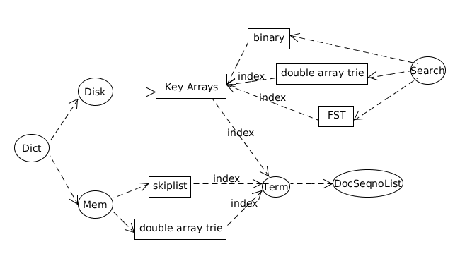
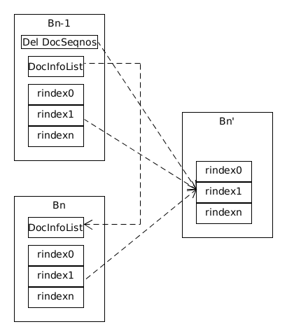
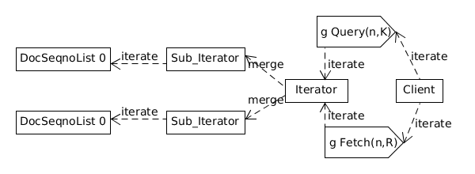

1. ##前言

2. ##相关模型和相关引擎
   万事万物之间都有关联，本节将建立一个描述各事物之间相互关系的模型，并描述一个系统可以将相关性进行管理和查询的系统。
   1. ###相关模型
      
      * 如图，有三个集合 A B C，可以通过一个方法判断两两之间的某个元素是否相关，那么选取其中的元素 a b c，如果判断出 ab ac bc 都相关，那么我们可以认为 a b c 是相关的。如果只有 AB 和 BC 存在相关性，那么可以通过判断 ab 和 bc 是否相关来确定 abc 是否相关。
      * 可以将上面的例子推广：
         1. 设 n 个集合的集合为 A {A(1),A(2),...,A(n)} 其中每个A()可选取的任意一个元素组成的集合为 a {a(1),a(2),...,a(n)} 
         2. 设 A 集合存在 m { m>=(n-1) && m<=(n*(n-1)/2) } 个相关性集合 L {L(1),L(2),...,L(m)} ，使A集合的元素彼此联通，并且两个A()集合之间最多存在一个相关性。
         3. 对于某个集合 a ,如果使 L 成立， a 称之为对于相关性集合L成立。
         4. 在集合 a 中选取 x 个值可以组成集合 ax(x)，如果满足3，ax(x)相对集合L也是成立的。
   2. ###相关引擎【Conan】
      
      本文设计的相关引擎可以快速的根据预设的若干个数据集之间的关系查询相关的数据：
         1. 以相关性集合L作为输入。
         2. 可以插入和删除L中描述的数据集合，系统会对数据进行存储和索引。
         3. 可以根据某个数据集中的元素快速查询使L成立的其他数据集的组合。
      当然，真实系统会随着n的个数增加而计算量剧烈增长，因此实际应用中会限制n的个数，并将数据分片存储。

3. ##相关性的分层结构
   为了能够使Conan存储并索引到A集合中各个子集合之间的关系，并能快速根据条件查询任何一个符合L的子集，我们将相关模型分层构建。
   1. 相关性分层
      
      我们先看一个三个集合的例子，A B C三个集合，两两之间可能相关或者不相关，如relation1，relation2，relation3，其中relation1情况下，ABC 不相关。而relation3是最负杂相关性的例子，上图是relation3的分层结构。
         1. 如果集合个数为 n ,整体则分为 n 大层，如 leve 1 ~ leve 3。
         2. 第 n 层处理 n 个相关集合组合与其他一个集合的相关的情况，如 level 1 处理1个集合关联另一个集合的情况，而 level 3 处理3个集合关联另一个集合的情况。
         3. 每个大层分为两个小层 leve n.0 level n.1。
         4. 0小层为关键词索引层，这个关键词索引可以快速的根据某个查询条件查出该层的所有相关组合。
         5. 1小层为相关索引，记录准确的单个元素和该层组合的相关性。
         6. 特别的，对于最后一层，只有0小层，没有1小层，因为不存在另外一个元素可以关联n个元素的组合。

   2. 相关集合和剩余集合
      

4. ##层的操作

5. ##存储和查询

6. ##检索结构

7. ##检索结构的合并

8. ##分片与归并

9. ##折中方案